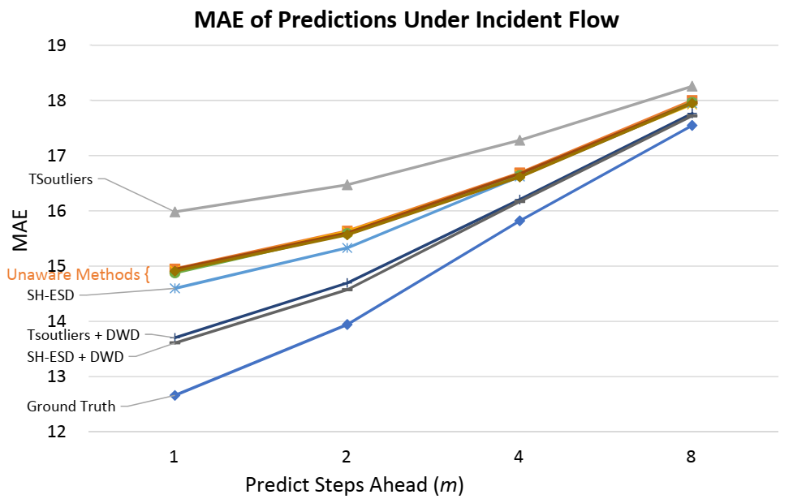
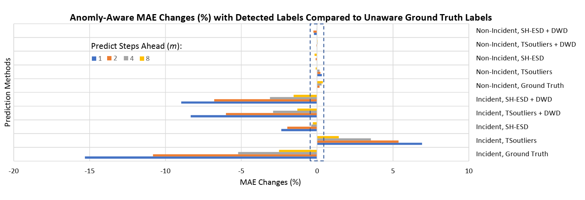

# Anomaly-Aware Traffic Prediction Based on Automated Conditional Information Fusion

# Background
Choosing the right parameter values for kNN is problematic.
We propose to calculate weighted average dynamically according to flow situation, normal vs. abnormal.


# Usage of Code
GPU raw result code is available in repo: [level 1](https://github.com/SunnyBingoMe/code_knn_level1_cuda), which is used to generate parameters' combinations' results.

Note: the implementation is not considering the data as stream as it just make the handling of data non-necessaryly more complex than evaluation's requirement, more like an industry software.


# Results
The results show that
the proposed method with incident labels improves predictions
up to 15.3% and the DWD enhanced anomaly-detection improves
predictions up to 8.96%. Conditional information fusion improves
ensemble prediction methods, especially for incident traffic. The
proposed method works well with enhanced detections and the
procedure is fully automated. 






# Citation Request
**[IEEE Format]** B. Sun, C. Wei, M. Liyao, and G. Prashant, “Anomaly-Aware Traffic Prediction Based on Automated Conditional Information Fusion,” in International Conference on Information Fusion (FUSION), Cambridge, United Kingdom, 2018, pp. 2283–2289.

**[AAA Format]** 
Sun, Bin, Cheng Wei, Ma Liyao, and Goswami Prashant 2018Anomaly-Aware Traffic Prediction Based on Automated Conditional Information Fusion. In International Conference on Information Fusion (FUSION) Pp. 2283–2289. Cambridge, United Kingdom: IEEE.

**[GB/T 7714-2005]** SUN B, CHENG W, MA L等. “Anomaly-Aware Traffic Prediction Based on Automated Conditional Information Fusion[C]//IEEE International Conference on Information Fusion (FUSION). Cambridge, United Kingdom: IEEE, 2018: 2283–2289.

**[BibLatex]:**

```tex

@inproceedings{sun2018anomalyaware,
  location = {{Cambridge, United Kingdom}},
  title = {Anomaly-{{Aware Traffic Prediction Based}} on {{Automated Conditional Information Fusion}}},
  abstract = {Reliable and accurate short-term traffic prediction plays a key role in modern intelligent transportation systems (ITS) for achieving efficient traffic management and accident detection. Previous work has investigated this topic but lacks study on automated anomaly detection and conditional information fusion for ensemble methods. This works aims to improve prediction accuracy by fusing information considering different traffic conditions in ensemble methods. In addition to conditional information fusion, a day-week decomposition (DWD) method is introduced for preprocessing before anomaly detection. A k-nearest neighbours (kNN) based ensemble method is used as an example. Real-world data are used to test the proposed method with stratified ten-fold cross validation. The results show that the proposed method with incident labels improves predictions up to 15.3\% and the DWD enhanced anomaly-detection improves predictions up to 8.96\%. Conditional information fusion improves ensemble prediction methods, especially for incident traffic. The proposed method works well with enhanced detections and the procedure is fully automated. The accurate predictions lead to more robust traffic control and routing systems.},
  eventtitle = {International Conference on Information Fusion (FUSION)},
  booktitle = {International {{Conference}} on {{Information Fusion}} ({{FUSION}})},
  publisher = {{IEEE}},
  author = {Sun, Bin and Wei, Cheng and Liyao, Ma and Prashant, Goswami},
  date = {2018-07-10}}


```

# Paper
The full-text paper is available on [Diva](http://urn.kb.se/resolve?urn=urn:nbn:se:bth-16942) and [ResearchGate](https://www.researchgate.net/publication/327483665_Anomaly-Aware_Traffic_Prediction_Based_on_Automated_Conditional_Information_Fusion).
